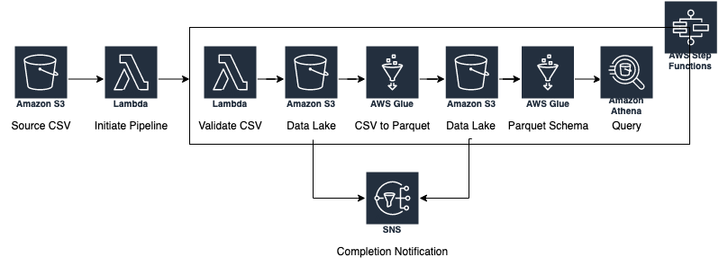

## What is a Data Lake?
A Data Lake is a unified location for ingesting structured and unstructured data while retaining the data's original
format. They are typically built upon cloud storage services such as AWS S3, Azure Storage, and Google Cloud
Storage, so they are relatively easy to scale at low cost. A data lake will often have distinct zones such as
raw, structured, and curated, where varying data formats, logic, and governance rules apply. Due in part to increased
flexibility afforded by paradigms like interpreting the schema on read instead of defining on write, data lakes are
conducive to Online Analytical Processing (OLAP) applications like Internet of Things (IoT) and Machine Learning (ML).

On the other hand, a data warehouse encapsulates structured, relational data that typically supports Online
Transactional Processing (OLTP) use cases such as traditional batch Business Intelligence (BI) reporting via tools
like SAP Business Objects, PowerBI, and Tableau. Because of the stricter controls on data formats and representation
(e.g., normalization), data warehouses are relatively more expensive to scale than data lakes.

## Explain serverless architecture.
Serverless architecture describes a pattern where application deployments needn't worry about managing infrastructure,
because it is managed by the cloud provider. For example, Azure App Service allows developers to deploy web 
applications, and AWS Lambda provides short-lived (<15 minutes) code execution, all without managing machines, virtual
or otherwise. Serverless services allows organizations to concentrate on improving their product instead of scaling,
patching, securing, and monitoring machines. Additionally, because serverless architecture is often billed by usage, 
serverless architectures _may_ be more economical than their dedicated counterparts. After all, paying for allocated
virtual machine resources for a process that runs a couple of times per day is likely more expensive than paying for a
couple of hours of compute time with a serverless offering. However, serverless' benefits can instead be considered weaknesses.
When considering use cases that require increased customization, developers are limited in which libraries,
operating systems, web servers, et cetera, they are able to deploy because the cloud services provider manages the 
infrastructure, not developers. Furthermore, as serverless usage increases, it often becomes more expensive relative to
dedicated resources.

## ETL pipeline

The pipeline documented above originates with a CSV file being delivered to an S3 bucket. Upon delivery, the CSV file
instigates an S3 event, which triggers a Lambda Function. The Lambda Function, in turn, triggers the Step Function.
Within the Step Function, a Lambda Function validates the CSV file, and writes it to the data lake or
a failure directory, depending on the outcome of the validation process. The S3 notification from the datalake is
delivered to SNS, which could notify Slack, DataDog, or others of the validation status. AWS Glue then converts the
now-validated CSV file to parquet format, which is delivered to a different location within the datalake, upon which 
SNS is again notified of this S3 event. The parquet file's schema is then registered with Glue's catalog, and AWS
Athena is able to query the parquet file via Glue.

## Describe modern MLOps
MLOps, or Machine Learning Operations, is the process of deploying machine learning models to production, including
maintenance and monitoring. At a minimum, the process includes Data Scientist and ML Engineer personas, but can also
incorporate DevOps, Site Reliability (SRE), and Cloud engineers.

Databricks' graphic below outlines the high level procedures of MLOps:

There are three primary components to the MLOps pipeline: feature engineering, machine learning model development, and
model deployment. 

### Feature Engineering
Feature Engineering is the process of creating features, the input for machine learning models, from raw data. For example,
a model that predicts a marketing campaign's impressions may incorporate budget, medium, seasonality, and other data
points as features. It's important to track how these features are created because the same feature definitions will need
to be used when making inferences, or predictions, on the ML model. The two primary tools to track features are version
control (e.g., GitHub, GitLab) for the source code generating the features, and a feature store to store the data itself.
Feature stores are central locations for storing features to be shared across models and teams, and there are two types:
online and offline. Online feature stores are necessary when inference requests are naive, meaning the end user does not
have features to provide because they are calculated by a separate process. For example, if an end user wants to infer
the cost of a home with current market conditions, the model would need to retrieve the features representing current market
conditions from the online feature store; the end user would not have access to them nor know which data points the model
is using. On the other hand, offline stores suffice when end users provide features, or raw data that can be transformed
into features computationally inexpensively.

Speaking of storage, it's also important to consider the five Vs of data:
* Velocity
* Volume
* Value
* Variety
* Veracity

These factors will determine whether the feature pipeline needs an Extract Load Transform (ELT) pipeline in front
of it, and where the data should be stored.

### Model Development
Model development is the iterative process of experimenting with different features, hyperparameters, and algorithms. There
are numerous libraries available across various programming languages. Some of the most popular are
[Scikit-Learn](https://scikit-learn.org/stable/), [PyTorch](https://pytorch.org/), and [TensorFlow](https://www.tensorflow.org/).
When evaluating a tool, it's important to consider its popularity, efficiency, and support. Popularity is often an indicator
of how well the tool works, and means there will be more talent available on the market to support an organization's platform,
as well as discussions on technical forums for extra support. A tool's efficiency informs cost and performance, and its
support availability is just as important: are there professional services available or an active online community? 

During the development process it's also important to record the metrics and artifacts of each of these experiments
so that data scientists can compare model runs to determine which configuration yields the best performance.
[MLflow](https://mlflow.org/) is one such tool that provides a tracking server to record and query these experiments.
Once a model configuration has been identified as the best performing, it can be registered with MLflow's model registry.
A registered model is serialized and ready for deployment.

### Model Deployment
When a model is ready for deployment, there are many questions to consider, such as:
* How can Continuous Delivery be set up?
* Will inferences be real-time, or batch?
* Will inference requests be made via API?
* How is deployment monitored and scaled?
* How will features be retrieved?
* How large is the data, and of what format?
* How is feedback received from a model in production?

Answering these questions will determine how a model will be deployed to production, and which tools can support an
organization's use case. Databricks Model Serving is great for batch or simple real-time inferences, but complex
requirements may necessitate more complex, open-source tools such as TFX or Kubeflow, which compels additional skills
to deploy.
